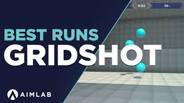
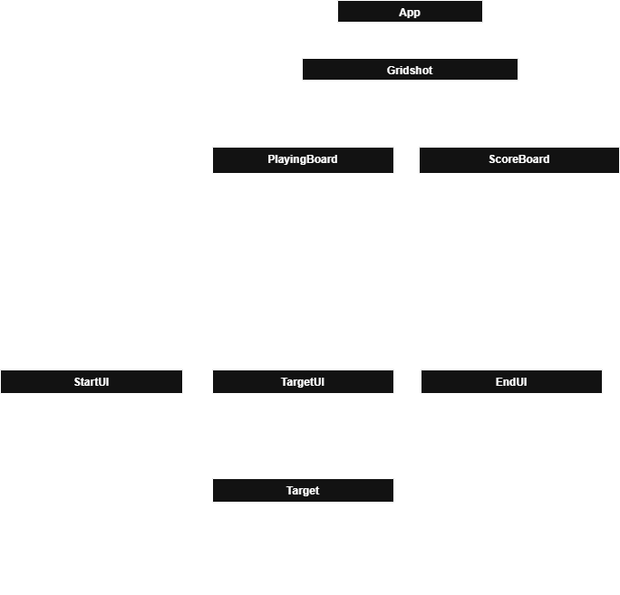

# Gridshot - React Project

This project is my recreation of the "Gridshot" game from **Aim Lab**.

[Aim Lab](https://aimlab.gg/)

---

## Summary

This project is my first attempt after learning React. The goal was to demonstrate my understanding of components and hooks such as `useState`, `useRef`, and `useEffect`. To showcase these skills, I decided to create a clone of the "Gridshot" game from **Aim Lab**.

You can play the game and see my work live on GitHub Pages: [https://veasnab.github.io/gridshot/](https://veasnab.github.io/gridshot/)

## Outcome

The project was built using **Vite** and **React**, utilizing JSX syntax. Here’s a list of tools and technologies used:

### Tools & Technologies

| **Technology**                  | **Description**                             |
|----------------------------------|---------------------------------------------|
| **React**                        | For building the user interface with JSX syntax. |
| **Vite**                         | For project setup and bundling.            |
| **VS Code**                      | Text editor used for development.          |
| **Google Chrome**                | Browser used for development and testing.  |
| **React Developer Tools**        | For enhanced React development.            |
| **GitHub Pages**                 | For deploying the project.                 |
| **JavaScript**                   | For functionality and logic.               |
| **HTML**                         | For structure and layout.                  |
| **CSS**                          | For styling the user interface.            |

## UML Diagram of Components

Here is a high-level overview of the components used in this project:

## How to Play

1. Visit the live demo: [Gridshot](https://veasnab.github.io/gridshot/)
2. Play the game and try to beat your score!

